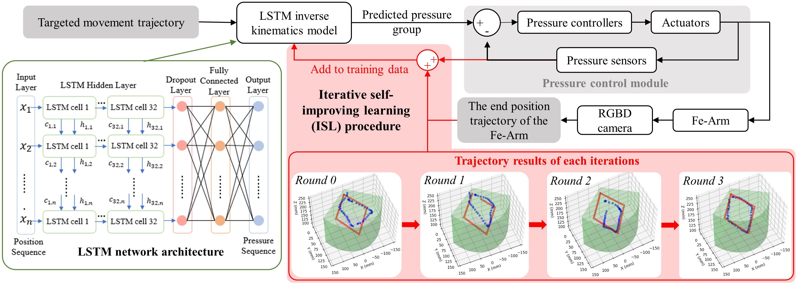

ISL-SoRoModel
==============================
This repository contains the code for the paper "Foam-Embedded Soft Robotic Joint With Inverse Kinematic Modeling by Iterative Self-Improving Learning". The paper is published in IEEE Robotics and Automation Letters (RA-L) and will be presented at the International Conference on Intelligent Robots and Systems (IROS) 2024. 

[Paper](https://ieeexplore.ieee.org/document/10381770)

The code is written in Python and uses PyTorch for the neural network implementation.

Method
--------------------------

*Schematic diagram of the LSTM-based iterative self-improving learning method (ISL) for end-to-end inverse kinematic modeling.*

Usage
--------------------------
- \model_training\train_lstm_pose2pres.ipynb: Train the LSTM model for the pose-to-pressure modeling mapping.
- \trajectory_tracking\traj_ctrl_generation_LSTM.ipynb: Generate the trajectory control pressure value using the obtained LSTM model.
- \trajectory_tracking\traj_verification.ipynb: Verify the trajectory predicting and controlling performance of the soft robotic arm.

Citation
--------------------------
If you find this code useful, please cite the following paper:
```bibtex
@article{huang2024foam,
  title={Foam-Embedded Soft Robotic Joint With Inverse Kinematic Modeling by Iterative Self-Improving Learning},
  author={Huang, Anlun and Cao, Yongxi and Guo, Jiajie and Fang, Zhonggui and Su, Yinyin and Liu, Sicong and Yi, Juan and Wang, Hongqiang and Dai, Jian S and Wang, Zheng},
  journal={IEEE Robotics and Automation Letters},
  year={2024},
  publisher={IEEE}
}